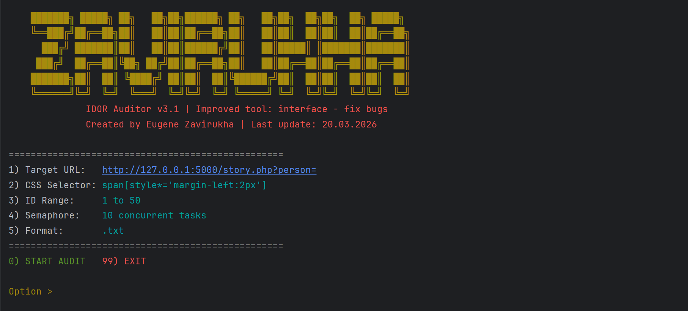
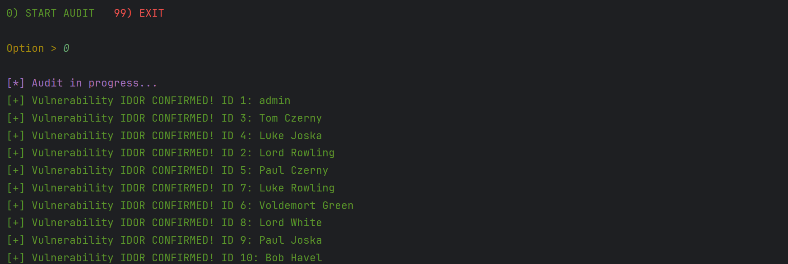
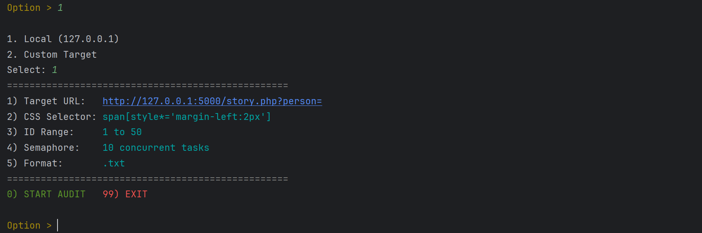

# IDOR Auditor v3.1 (Improved interface for user)
## Preview

### 1. Tool Banner & Interface


### 2. High-Speed Asynchronous Scanning


### 3. Settings


### 4. Saving as .txt


### 5. Generated Report (TXT Output)


## Project Overview
IDOR Auditor v3.1 is a high-performance security auditing tool designed to identify Insecure Direct Object Reference (IDOR) vulnerabilities. Unlike basic scripts, v3.1 is built on a Modular Architecture, separating the User Interface, the Scanning Engine, and Utility functions.

This version introduces Smart Scraping, allowing researchers to target specific data points using CSS selectors, making it adaptable to any web environment.

## Key Features (v3.1)

| Feature | Description | Technical Component |
| :--- | :--- | :--- |
| **Modular Architecture** | Clean separation of UI, Logic, and Utils. | `main.py`, `scanner.py`, `utils.py` |
| **Interactive Dashboard** | Full CLI control panel for real-time config. | `main.py` |
| **Smart Scraping** | Dynamic data extraction via CSS Selectors. | `BeautifulSoup4` |
| **Async Core** | Industrial-grade scanning speed. | `asyncio` & `aiohttp` |
| **Traffic Shaping** | Prevents WAF triggers and DoS conditions. | `asyncio.Semaphore` |
| **Robust Reporting** | Automated sanitized .txt reports. | `utils.py` |
| **Python 3.10+** |
| **Technical Stack** |

Project Structure
```
.
├── app.py           # Vulnerable Flask Lab
├── main.py          # Dashboard & CLI logic
├── scanner.py       # Async Engine
├── utils.py         # Helper functions
├── requirements.txt # Dependencies
├── README.md        # Documentation
└── LICENSE          # Apache License 2.0.
```
## How to Run the Lab

1. **Cloning git:**
   ```bash
   git clone https://github.com/ich-bin-eugenius/IDOR-Educational-Project

2. **Install dependencies:**
   ```bash
   pip install -r requirements.txt


3. **Start the vulnerable server:**
   ```bash
   python app.py

4. **Run the security scanner:**
   ```bash
   python main.py


⚖️ Legal & Ethical Notice
FOR EDUCATIONAL PURPOSES ONLY. This tool is intended for security researchers and developers to test their own systems. Unauthorized testing of third-party websites is illegal. The author is a 14-year-old student practicing ethical hacking and responsible disclosure.

**⚖️ License & Attribution**
This project is licensed under the Apache License 2.0. 

*Requirements for redistribution:*
1. You must retain the original copyright notice: `Copyright (c) 2026 Eugene Zavirukha`.
2. If you modify the code, you must include prominent notices stating that you changed the files.
3. Proper attribution to the original repository must be maintained.

Author
Eugene Zavirukha

Date: 21.03.2026

Focus: Web Security, Asynchronous Python Automation, and Security Auditing