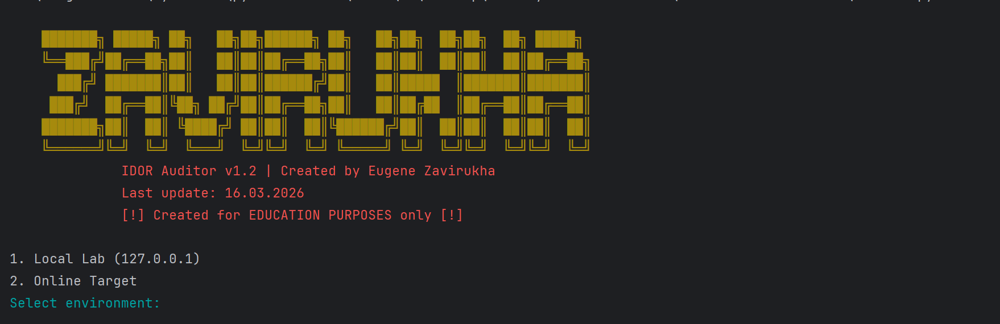
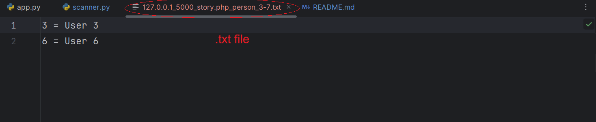

# IDOR Security Auditor (v2.01 - Async Edition)

## 🖼️ Preview

### 1. Tool Banner & Interface

*Updated professional ASCII interface with environment and range selection.*

### 2. High-Speed Asynchronous Scanning

*Concurrent vulnerability detection using asyncio and semaphores for optimized performance.*

### 3. Generated Report (TXT Output)

*Sanitized report showing ID and username correlation, now including scan range in filename.*

---

## 📖 Project Overview
This project is a cybersecurity educational lab consisting of a **vulnerable web application** and a **high-performance security auditing tool**. It demonstrates the risks of **Insecure Direct Object Reference (IDOR)**—a critical vulnerability where an application provides direct access to objects based on user-supplied input without proper authorization.

The tool has been recently upgraded from a synchronous model to a fully **asynchronous engine**, allowing for rapid security audits without sacrificing system stability.

## 🚀 Key Features

- **Asynchronous Engine:** Powered by `asyncio` and `aiohttp` for concurrent request handling.
- **Smart Rate Limiting:** Implements `asyncio.Semaphore` to limit concurrent connections, ensuring the target server remains stable during audits.
- **Persistent Sessions:** Utilizes `aiohttp.ClientSession` for connection pooling, significantly reducing overhead.
- **Dynamic Scoping:** Users define custom `Start ID` and `End ID` ranges at runtime.
- **Heuristic DOM Parsing:** Uses `BeautifulSoup4` to verify sensitive data presence, effectively filtering out false positives and empty pages.
- **Professional CLI:** Color-coded feedback and a refined ASCII banner for a clear auditing experience.

## 🛠️ Technical Stack
- **Python 3.10+**
- **Aiohttp:** For high-speed asynchronous HTTP communication.
- **Asyncio:** For managing concurrent task execution and rate limiting.
- **BeautifulSoup4:** For advanced HTML structure analysis.
- **Colorama:** For cross-platform terminal styling.
- **Flask:** For the vulnerable web application simulation.

## 📁 Project Structure
- `app.py`: The vulnerable portal simulation (Flask).
- `scanner.py`: The asynchronous auditing engine.
- `requirements.txt`: Updated list of necessary Python libraries.

## 🔍 How to Run the Lab

1. **Cloning git:**
   ```bash
   git clone https://github.com/ich-bin-eugenius/IDOR-Educational-Project

2. **Install dependencies:**
   ```bash
   pip install -r requirements.txt


3. **Start the vulnerable server:**
   ```bash
   python app.py

4. **Run the security scanner:**
   ```bash
   python scanner.py


⚖️ Legal & Ethical Notice
FOR EDUCATIONAL PURPOSES ONLY. This tool is intended for security researchers and developers to test their own systems. Unauthorized testing of third-party websites is illegal. The author is a 14-year-old student practicing ethical hacking and responsible disclosure.

👤 Author
Eugene Zavirukha

Date: 17.03.2026

Focus: Web Security, Asynchronous Python Automation, and Security Auditing