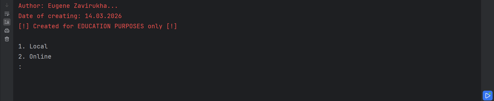

# IDOR Vulnerability Simulation & Security Auditor




This project is a cybersecurity educational lab consisting of a **vulnerable web application** and an **automated security scanning tool**. It is designed to demonstrate the risks of **Insecure Direct Object Reference (IDOR)** and show how automated tools can be used for security auditing.

## 📖 Background
I discovered a real-world IDOR vulnerability where personal data was exposed through unauthenticated URL parameter manipulation. To document this safely in my portfolio, I created this local laboratory environment to simulate the flaw and its detection.

## 🚀 Key Features of the Scanner

- **Environment Selection:** The tool allows the user to choose between a pre-configured **Local Lab** (Flask) or a **Custom Online URL**.
- **Robust Error Handling:** Includes advanced handling for `Connection Errors`, `Timeouts`, and unexpected server responses to ensure stable auditing.
- **Deep Content Analysis:** Instead of relying on HTTP status codes, the tool uses `BeautifulSoup` to parse HTML and verify the presence of leaked data (student names).
- **Validation Logic:** The scanner identifies specific patterns like `<span style="margin-left:2px;">` to distinguish between active data leaks and empty templates.

## 🛠️ Project Structure

- `app.py`: A Python Flask application simulating a student portal with a deliberate IDOR vulnerability.
- `scanner.py`: The security auditor tool (the code I developed).

## 🔍 How to Run the Lab

1. **Install dependencies:**
   ```bash
   pip install flask requests beautifulsoup4 colorama
Start the vulnerable server:

Bash
python app.py
Run the security scanner:

Bash
python scanner.py
Follow the on-screen menu to select the environment and start the scan.

⚖️ Legal Disclaimer
FOR EDUCATIONAL USE ONLY. This tool is intended for security researchers and developers to test their own systems. Unauthorized testing of third-party websites is ILLEGAL.

👤 Author
Eugene Zavirukha

Created on: 14.03.2026

Focus: Web Security, Python Automation, and Ethical Hacking